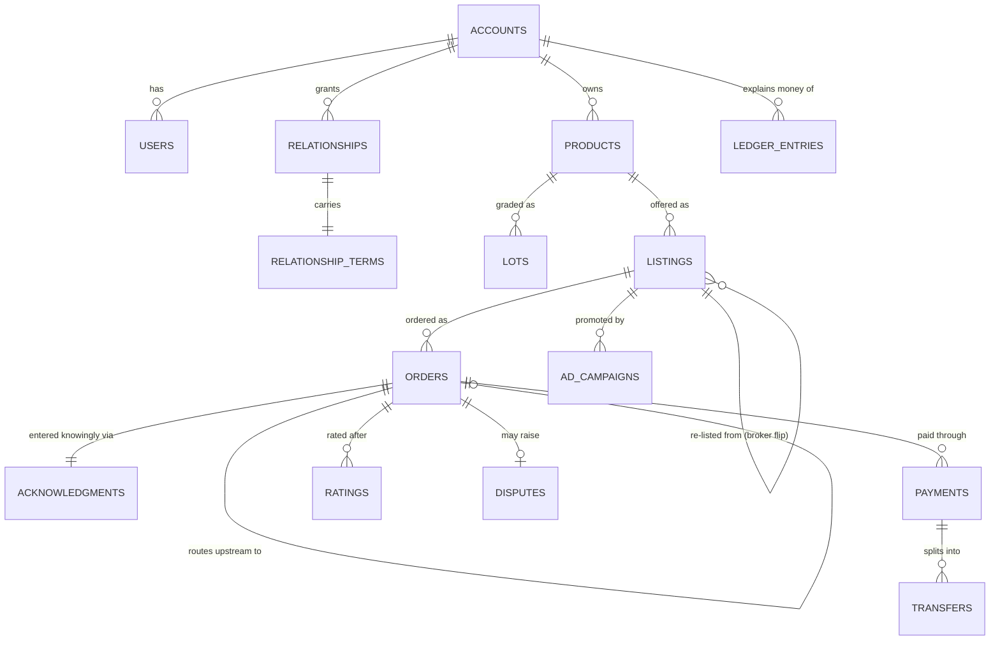

# Platform Architecture — Modules, Departments & Database

> The build map for QuietLot: what modules exist, what order to build them in, how the store is
> organized (departments/sections), and the database schema underneath. Companion to
> BLUEPRINT.md (product design), SECURITY.md (identity/authz), ESCROW-PLAN.md (money).

---

## 1. Module map (what to build)

Modules in build order. **Phase 1** = needed for the first real order. **Phase 2** = needed to
scale trust and liquidity. **Phase 3** = the moats.

| # | Module | What it does | Phase |
|---|--------|--------------|-------|
| M1 | **Identity & Access** | Cognito sign-in, invite-code gate, MFA, org users/roles | 1 |
| M2 | **Accounts & Verification** | Business accounts, KYB via Stripe, storefront aliases, resale certs | 1 |
| M3 | **Relationship Graph** | Invites, access requests, approvals, per-edge terms, shields, reveal grants | 1 |
| M4 | **Catalog** | Products, lots, manifests, condition grades, units/packaging math | 1 |
| M5 | **Marketplace** | Channel-scoped discovery, offers, teasers, bands, sponsored placement | 1 |
| M6 | **Orders & Routing** | Order chains, auto-routing, blind drop-ship, held stock | 1 |
| M7 | **Payments & Ledger** | Stripe Connect escrow flow, splits, fees, append-only ledger | 1 |
| M8 | **Messaging & Masking** | Threads, contact-info filter, relay mode | 1 |
| M9 | **Negotiation** | Private per-channel price negotiation, accepted-price application | 2 |
| M10 | **Trust & Reputation** | Double-blind ratings, disputes ladder, audit log | 2 |
| M11 | **Broker Tools** | Broker HQ: pipeline, source vault, buyer book, flip calculator, margin analytics | 2 |
| M12 | **Ads** | Sponsored + teaser boosts, blind routing, identity-free attribution | 2 |
| M13 | **Logistics** | Freight quotes, blind BOLs, tracking ingestion, delivery confirmation | 2 |
| M14 | **Notifications** | Digests, event pushes, re-engagement | 2 |
| M15 | **Admin & Ops console** | KYB review, disputes desk, content moderation, category/license gates | 2 |
| M16 | **Access Capital** | Deal financing marketplace (see §5) — *build later, design now* | 3 |
| M17 | **Data & Analytics** | Market indices (masked comps), seller/broker dashboards, platform BI | 3 |
| M18 | **API & Integrations** | Inventory feed ingestion (CSV/API), QuickBooks export, webhook API | 3 |

HUBX-inspired additions worth stealing (they run anonymous B2B at $200M+/yr scale):
**real-time inventory feeds** (M18 — sellers sync stock via file/API so offers never go stale),
and an optional **platform-takes-title mode** (M6 — for the biggest deals, the platform itself
becomes the counterparty of record on paper, making the mask airtight through customs/freight docs).

## 2. Departments (store taxonomy)

Walmart-style department tree, tuned for closeout/wholesale. Two axes: **what it is**
(department) × **what kind of deal it is** (deal type). Every listing carries both.

**Departments → sections:**
1. **Grocery & Beverage** — shelf-stable food · beverages · snacks · short-date/closeout food
2. **Health & Beauty (HBA)** — personal care · OTC (licensed) · vitamins · cosmetics
3. **Home & Kitchen** — textiles/linens · cookware · storage · furniture · décor
4. **Cleaning & Chemicals** — household cleaning · janitorial · laundry
5. **Electronics & Accessories** — consumer electronics · accessories · returns/refurb programs
6. **Apparel & Footwear** — men's/women's/kids · shelf-pulls · irregulars
7. **Toys, Seasonal & Party** — toys · holiday · seasonal programs
8. **Office & School** — supplies · paper · back-to-school programs
9. **Tools & Hardware** — hand/power tools · fixtures · MRO surplus
10. **Pet** — food (dated) · supplies
11. **General Merchandise / Mixed Lots** — mixed pallets · store returns · flea/discount programs

**Deal types (orthogonal):** Closeout · Overstock · Shelf-pull · Store returns · Refurbished ·
Salvage · In-line (regular wholesale) · Short-dated.

**Condition grades:** New/Sealed · Like-new/Open-box · Grade B · Salvage — with the
grade-dependent dispute windows from MARKET-TERMS §7.

## 3. Application sections (site IA)

What a signed-in user sees (mirrors the demo):

- **Marketplace** — channel-scoped offers + locked teasers, department filters, sponsored strip
- **Broker HQ** *(brokers)* — pipeline, KPIs, source vault, buyer book, flip calculator, Access Capital
- **Sources** *(brokers)* — upstream channels, shields, re-listing
- **Products / My Listings** *(sellers/brokers)* — catalog, lots, manifests, held stock
- **Ads Manager** *(sellers/brokers)* — sponsored, teaser boosts, stats
- **Deals** — negotiations
- **Orders** — chains, routing, tracking, confirmation
- **Messages** — masked/relayed threads
- **Network** — relationships, terms, invites, reveal controls
- **Payments** — escrow states, payouts, fees, statements (the demo's "Wallet", renamed per ESCROW-PLAN §5)
- **Admin console** *(staff only)* — verification desk, disputes desk, moderation, config

## 4. Database structure

Postgres, one schema, **row-level security keyed to the relationship graph** (SECURITY.md §1).
Append-only where money or evidence is involved.

### Core tables

```
accounts            id, legal_name*, alias, avatar, kind_flags{seller,broker,buyer},
                    kyb_status, stripe_account_id, fee_tier, created_at
                    (*legal identity columns are field-encrypted; alias is what renders)
users               id, account_id→accounts, cognito_sub, email, role{owner,manager,viewer}, mfa_enrolled
invites             id, inviter_account_id, code, kind, expires_at, used_by_account_id
relationships       id, grantor_id→accounts, grantee_id→accounts, kind{broker,buyer},
                    status{pending,approved,revoked}, requested_by, share_upstream bool,
                    started_on_platform bool, last_txn_at   -- non-circumvention clock
relationship_terms  relationship_id→, comm{relay,direct}, reveal bool, price_floor,
                    min_volume, band_cap, excluded_product_ids[], updated_by, updated_at
reveal_grants       id, from_account, to_account, granted_at        -- one-way, append-only
products            id, owner_id→accounts, name, brand, department, section, deal_type,
                    base_unit, upc, img, created_at
lots                id, product_id→, condition_grade, manifest_url, expiry_date, origin
listings            id, owner_id→accounts, product_id→, lot_id→, source_listing_id→listings,
                    unit, unit_contains, price, moq, stock, held_for_source bool,
                    active, negotiable, teaser, sponsored, boost_teaser
orders              id, buyer_id→accounts, owner_id→accounts, listing_id→, qty, unit_price,
                    total, status{placed,confirmed,routed,shipped,delivered,disputed,cancelled,refunded},
                    upstream_order_id→orders, downstream_order_id→orders,
                    fulfilled_from_stock bool, acknowledgment_id→, created_at
acknowledgments     id, order_id→, buyer_user_id→, unit_math_json, grade, freight_terms,
                    dispute_window, masked_counterparty bool, accepted_at   -- MARKET-TERMS §5
negotiations        id, listing_id→, buyer_id→, status{open,countered,accepted,declined},
                    qty, price, history_json
payments            id, order_chain_id, stripe_payment_intent, method{card,ach}, amount,
                    status{pending,held,released,refunded,frozen}
transfers           id, payment_id→, to_account_id→, stripe_transfer_id, amount, kind{cost,margin,fee}
ledger_entries      id, account_id→, order_id→, amount, kind, balance_after, created_at  -- append-only
threads             id, listing_id→, participant_ids[], relay_via_account_id
messages            id, thread_id→, from_account_id→, text_filtered, flagged bool, relayed bool, created_at
ratings             id, order_id→, rater_id→, ratee_id→, stars, text, double_blind_release_at
disputes            id, order_id→, opened_by→, reason, status{open,resolved,arbitrated},
                    outcome{release,partial,refund}, evidence_json, resolved_at
ad_campaigns        id, owner_id→, listing_id→, placement{sponsored,teaser_boost},
                    weekly_rate, status, impressions, clicks, started_at
audit_events        id, actor_id, kind, subject_type, subject_id, data_json, created_at  -- append-only
```

### The relationships that matter (ER sketch)



**Design rules:** every query is scoped through `relationships` in RLS — "no relationship, no
row." `listings.source_listing_id` is the broker-flip chain, and it is **never** exposed
downstream. Legal identity lives in encrypted columns only the verification service reads;
every render path goes through the alias. `audit_events` + `acknowledgments` are the dispute
evidence base.

## 5. Access Capital (M16 — design now, build later)

The cash-flow killer, productized: connect people with capital to confirmed deals needing float.

**Flow:** broker's buyer places a confirmed, escrow-acknowledged order the broker can't float →
broker requests funding on that specific order chain → vetted funders see a **masked deal card**
(department, grade, order total, margin, both counterparties' *ratings* — never identities) →
funder commits at a published fixed return (e.g., 1.5–3% for the 2–6 week cycle) → funder's money
pays the upstream PO through the same escrow rails → on settlement, the split adds a funder leg:
funder principal + return, broker margin (net of funding cost), platform fee.

**New tables:** `capital_providers` (account_id, accreditation_status, limits, payout account),
`funding_offers` (provider_id, order_chain_id, amount, return_bps, term_days, status),
`funded_deals` (funding_offer_id, escrow refs, repayment status, default state).

**Risk containment:** fund only orders with buyer acknowledgment + escrow in place; platform
holds goods-side collateral (title passes through platform in funded deals — the
platform-takes-title mode earns its keep here); provider concentration limits; first-loss
reserve from platform fees on funded deals.

**⚠️ Legal gate (LAWYER-LETTER add-on):** deal-by-deal funding from third parties is likely a
**securities offering** (funders expect profit from others' efforts) and/or regulated lending —
this module does NOT ship without securities counsel. Options counsel will weigh: 506(c)
accredited-only structure, single-lender-of-record partner (how B2B BNPL platforms do it), or
platform-balance-sheet-only financing. The UI ships as "coming soon" + waitlist until then.

## 6. Suggested build sequencing (MVP calendar)

| Sprint | Ships |
|---|---|
| 1–2 | M1 Identity (Cognito + invite gate), M2 Accounts/KYB, skeleton UI in Hub design |
| 3–4 | M3 Relationship graph + RLS, M4 Catalog, M5 Marketplace (channel-scoped) |
| 5–6 | M6 Orders/routing, M7 Payments (Stripe test mode end-to-end), M8 Messaging/masking |
| 7 | M10 acknowledgments + audit + basic disputes; first real supervised order |
| 8+ | M9 Negotiation, M11 Broker HQ, M12 Ads, M13 Logistics — in whatever order the pilot cohort screams for |
